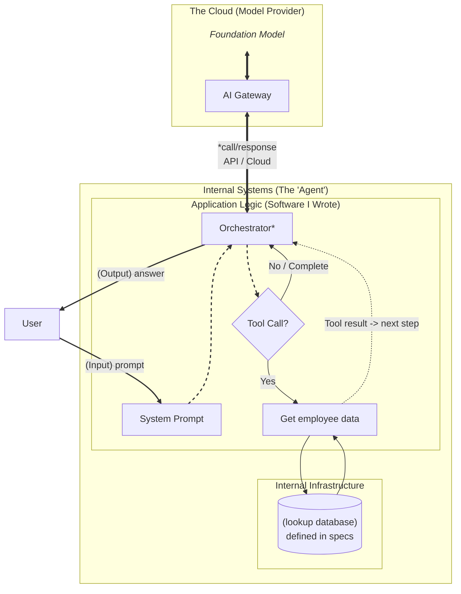

# AgentForge — Building Your First AI Agent

A hands-on workshop for technical people who use LLM chatbots every day but want to understand how they work. If you code then you can look at the code that makes them work and maybe write your own agent. 

Hands-on sandbox: **https://paddypawprints.github.io/agentforge/**

Source code: **https://github.com/paddypawprints/agentforge**

---

## Key Takeaways

Four concepts underpin everything in this workshop:

**Model** — receives text, outputs text. That's it. A stateless function you call over HTTP.

**Chatbot** — software that saves past interactions and feeds them back to the model each turn. Memory is not a model feature — it is application code.

**Agent** — a chatbot that is told it has access to tools, with software that can actually call them. An agent is a loop: the model decides what to do, the software runs the tool, the result is fed back, the model answers.

**Tool** — a piece of software that performs a function (read a file, query a database, make a payment). The result is injected into the conversation so the model can act on it. The model never calls the function itself — it emits a structured request and your code executes it.

---

## Scope — Who This Is For

This workshop is aimed at **technically literate people who are already comfortable using LLM chatbots** (ChatGPT, Claude, Gemini, etc.) but have not yet written code that calls a model API.

By the end of this session you will:

- Understand the difference between a raw language model and a chatbot product
- Know why memory is not a model feature — it is application code
- Have read and run a real agent loop (< 100 lines of TypeScript)
- Be able to extend the agent with your own tool

No prior AI/ML background is required. Basic familiarity with JavaScript or TypeScript is helpful but not essential — all the key code is annotated line-by-line.

---

## Workshop Agenda (90 min)

| Time | Section | Activity |
|------|---------|----------|
| 0:00 – 0:10 | **Introduction** | Key concepts, architecture overview, get API keys |
| 0:10 – 0:15 | **Setup** | Open the sandbox, confirm API key is working |
| 0:15 – 1:15 | **Exercises 1–7** | Hands-on: model → memory → system prompt → grounding → tools → agent loop |
| 1:15 – 1:30 | **Code Review** | Read the three service files (~200 lines total) |
| 1:30 – 1:45 | **Portkey (optional)** | Observability: connect Portkey, inspect logs, find PII |

Steps 9–11 (Portkey) are optional — skip them if you are running short on time or come back to them afterwards.

---

## Before You Start — Get Your API Keys

### Groq API Key (required)

You cannot send messages in the sandbox without a Groq API key. Here is how to get one in about two minutes:

1. Open [console.groq.com](https://console.groq.com) in a new tab.
2. Click **Sign Up** and create a free account (Google or GitHub login available).
3. Once logged in, click **API Keys** in the left sidebar.
4. Click **Create API Key**.
5. Give the key a name — anything works, e.g. `agentforge-workshop`.
6. Click **Submit**. The key is shown once — copy it now and save it somewhere safe (e.g. a notes app). You will need it again for the Portkey bonus exercises.
7. Return to the sandbox and paste the key into the **API KEY** field in the top-right of the header.
8. _Save your key_. If you do the AI gateway exercises later you will need it.
9. Press Enter or click away. The field will show a green border when a key is present.

The key is stored only in your browser's memory for the current session. It is sent directly to Groq and nowhere else. If you close and reopen the tab you will need to paste it again.

### Portkey API Key (bonus Steps 7–9 only)

[Portkey](https://portkey.ai) is an **AI gateway** — a proxy layer that sits between your application and any LLM provider. It gives you centralised logging, cost tracking, rate limiting, PII detection, and the ability to switch models or providers without changing application code. Think of it as an API gateway (like Kong or AWS API Gateway) purpose-built for LLM traffic.

For this workshop, Portkey lets you inspect every call the agent makes — the full prompt, the tool call, the tool result, token counts, and latency — from a single dashboard.

To get a free Portkey key:

1. Open [app.portkey.ai](https://app.portkey.ai) and sign up for a free account.
2. Once logged in, copy your **Portkey API key** from the dashboard home or the **API Keys** section.
3. Navigate to **Virtual Keys → Add Key**.
4. Select **Groq** as the provider.
5. Enter `aidaysf` as the slug (this is the virtual key identifier the sandbox uses).
6. Paste your Groq API key into the provider key field and save.

You now have a virtual key — a named alias for your Groq key stored securely in Portkey. The sandbox never needs your real Groq key when routing through Portkey; it uses the virtual key slug instead.

---

## 1. All the Code Is Here — Clone and Experiment

Everything shown in this presentation is in this repository. There are no hidden services, no proprietary SDKs, no magic. Clone it, run it locally, and break things.

```bash
git clone https://github.com/paddypawprints/agentforge.git
cd agentforge
npm install
npm run dev
```

Open `http://localhost:5173`. Enter your free Groq API key in the header and you are live.

Get a free Groq API key (no credit card required) at [console.groq.com](https://console.groq.com).

The three files that contain every concept in this workshop:

| File | What it does |
|------|-------------|
| [`src/services/memory.ts`](src/services/memory.ts) | Conversation memory — stores past turns and injects them into every new prompt |
| [`src/services/orchestrator.ts`](src/services/orchestrator.ts) | The agent loop — builds the prompt, calls the model, runs tools, returns the result |
| [`src/services/tools.ts`](src/services/tools.ts) | Tool definitions — what the model can call and how |

Everything else is UI that visualises those three files.

---

## Architecture



## 2. Model vs Chatbot — Memory and the Loop

When you open ChatGPT and have a multi-turn conversation, you might naturally assume the model "remembers" what you said. It does not.

**A language model is a stateless function.** Every time you call it, you hand it a block of text and it hands back a continuation. It has no memory of previous calls. Each request is completely independent.

```
Call 1:  [  "What's the capital of France?"  ]  →  "Paris."
Call 2:  [  "What's its population?"         ]  →  ??? (who is "its"?)
```

Call 2 fails — or hallucinates — because the model received no context.

**A chatbot product solves this by maintaining a messages array in application code** and passing the full conversation history on every call:

```
Call 2:  [
  { role: "user",      content: "What's the capital of France?" },
  { role: "assistant", content: "Paris." },
  { role: "user",      content: "What's its population?"        }
]
→  "Paris has a population of approximately 2.1 million in the city proper."
```

The model now has context. **Memory is not a model feature — it is a loop maintained by your code.**

This is the single most important concept in this workshop. Everything else builds on it.

---

## 3. Raw Models — What Are We Actually Working With?

Underneath every chatbot product is a foundation model: a large neural network trained to predict the next token in a sequence of text. Common open-weight and hosted models include:

| Model family | Provider | Notes |
|---|---|---|
| Llama 3.x | Meta (hosted by Groq, Together, etc.) | Open weights, fast |
| Mixtral | Mistral AI | Strong reasoning, MoE architecture |
| Gemma 3 | Google | Compact, efficient |
| Qwen 2.5 | Alibaba | Strong multilingual |

All of these expose the same basic API: send a `messages` array, receive a response. The differences are in speed, cost, context window, and quality on different tasks.

For this workshop we use **Groq** as our inference provider because:

- Free tier with generous rate limits
- Extremely fast inference (often < 1 second to first token)
- Supports multiple open models through one API
- Compatible with the OpenAI SDK — the same code works with OpenAI, Anthropic, and most other providers with a one-line change

---

## 4. The Sandbox — Where the Rest of This Tutorial Happens

Everything from here on takes place in the sandbox app. Open it now:

**https://paddypawprints.github.io/agentforge/**

Or run it locally:

```bash
git clone https://github.com/paddypawprints/agentforge.git
cd agentforge && npm install && npm run dev
```

Then open `http://localhost:5173`.

The app has three main areas:

- **Header** — API key input, model selector, temperature slider, agent mode toggle, and optional Portkey routing
- **System Prompt panel** (left) — editable system prompt with four presets: CHAT BOT, HR CHATBOT, BENEFITS DOC, HR AGENT
- **Chat + Trace panel** (right) — send messages and watch every LLM call, tool invocation, and response in the trace

Enter your Groq API key in the **API KEY** field in the header. The key is stored only in your browser's memory for this session — it is sent directly to Groq and nowhere else.

---

## 5. Try It in the App — Notice the Missing Memory

Open the sandbox: **https://paddypawprints.github.io/agentforge/** (or `http://localhost:5173` if running locally). Make sure your Groq API key is entered in the header.

1. Make sure **AGENT MODE** is **OFF** — this sends each message directly to the model with no orchestrator in the middle.
2. Send a message: `My name is Alex.`
3. The model responds and acknowledges your name.
4. Send a second message: `What is my name?`

The model says it does not know. **Each request is a fresh, independent call to the LLM.** Nothing carried over.

Now turn **AGENT MODE ON** and select the **CHAT BOT** preset. Repeat the same two messages. The model now remembers — because the orchestrator is rebuilding the full conversation history and sending it on every call.

Click **CLEAR** to wipe memory and try again. After the reset, it forgets — confirming that the memory lives in the app, not in the model.

**Key observation:** the difference between a stateless model call and a "chatbot" is entirely in application code. The orchestrator accumulates `{ user, assistant }` pairs in `memory.ts` and prepends them to every new prompt. That is the complete mechanism.

---

## 6. Memory Is Added by System Code — The Orchestrator

The component that manages the messages array, calls the model, and decides what to do with the response is called an **orchestrator**.

Here is the core of ours, lightly simplified:

```typescript
async function orchestrate(userMessage: string) {
  // 1. Add the new user message to the conversation history
  messages.push({ role: "user", content: userMessage });

  while (true) {
    // 2. Call the model with the FULL conversation history every time
    const response = await groq.chat.completions.create({
      model: "llama-3.3-70b-versatile",
      messages: messages,
      tools: availableTools,
    });

    const choice = response.choices[0];

    // 3. Did the model want to call a tool?
    if (choice.finish_reason === "tool_calls") {
      const toolCall = choice.message.tool_calls[0];

      // Execute the tool and get the result
      const result = await executeTool(toolCall.function.name, toolCall.function.arguments);

      // Add both the model's tool request AND the tool result to history
      messages.push(choice.message);
      messages.push({ role: "tool", tool_call_id: toolCall.id, content: result });

      // Loop — call the model again with the tool result in context
      continue;
    }

    // 4. Model is done — add its final response and return
    messages.push(choice.message);
    return choice.message.content;
  }
}
```

The full, annotated version is in [`src/services/orchestrator.ts`](src/services/orchestrator.ts).

This loop is the heart of every AI agent. Everything else — streaming, retries, multi-agent routing — is an elaboration of this pattern.

---

## 7. What Is an Agent?

There is a lot of hype around the word "agent". A useful working definition:

> **An agent is a language model that can take actions.**

The minimal version of that is: **a chatbot with tools**.

A tool is any function you expose to the model. You describe it in JSON (name, description, parameters) and the model decides when to call it, what arguments to pass, and how to incorporate the result. The model never calls the function itself — it emits a structured request, your code runs the function, and you hand the result back.

```
User:  "What are Alice's employee benefits?"
         ↓
Model: I need to look that up.
       → tool_call: benefits_lookup({ employee_id: "EMP001" })
         ↓
Code:  runs benefits_lookup, returns JSON
         ↓
Model: (reads the JSON result)
       "Alice Johnson has Premium PPO health coverage, 
        4 weeks annual leave, and is enrolled in the 
        401(k) with 6% employer match."
         ↓
User:  sees the final answer
```

The model contributed reasoning and natural language. The tool contributed real data. Neither could produce the correct answer alone.

Tools are defined in [`src/services/tools.ts`](src/services/tools.ts). Each tool has a JSON schema (what the model sees) and an `execute()` function (what actually runs). To add a new capability to the agent, add it there.

---

## 8. Hands-On — Play With a Real Agent

The sandbox at **https://paddypawprints.github.io/agentforge/** (and the local version you cloned) is a live environment where you can experiment with a minimal but complete agent:

- A system prompt you can edit in real time
- A `benefits_lookup` tool that queries a mock employee benefits database
- Full visibility into the messages array so you can watch the orchestrator work
- Step-by-step exercises that build from a plain chatbot up to a working agent

### Workshop Exercises

Open the sandbox before starting: **https://paddypawprints.github.io/agentforge/**

You will need your Groq API key in the **API KEY** field in the header — see **Before You Start** at the top of this document if you haven't done that yet.

---

#### Step 1 — Raw Model: No Memory

1. Make sure **AGENT MODE** is **OFF** (toggle in the header).
2. Send: *"My name is [your name]."* — the model acknowledges it.
3. Send: *"What is my name?"* — the model says it doesn't know.
4. Each request is a fresh, stateless call to the LLM. There is no conversation. You are sending a single message and receiving a single reply.

**↳ The model is not magic — it only knows what you put in the prompt.**

---

#### Step 2 — Memory: The Orchestrator Adds It

1. Turn **AGENT MODE ON** and select the **CHAT BOT** preset.
2. Repeat the same two messages: tell it your name, then ask what your name is.
3. It now remembers. The Orchestrator is injecting the previous turn into every new prompt automatically.
4. Click **CLEAR** in the header to wipe memory and try again — after the reset it forgets again.

**↳ "Memory" is just your app re-sending the conversation history every time.**

---

#### Step 3 — System Prompt: Shape the Model's Behaviour

1. Select the **HR CHATBOT** preset. The system prompt restricts the model to HR topics.
2. Send an on-topic message: *"What is the PTO policy?"* — the model answers (from training data, not real policy).
3. Send an off-topic one: *"Write me a poem."* — the model declines.
4. Edit the system prompt text directly — change the refusal instruction to something permissive — and ask again. Observe how behaviour shifts instantly.

**↳ The system prompt is your product — it's how you turn a general model into a specific assistant.**

---

#### Step 4 — Grounding: Inject a Document

1. Select the **BENEFITS DOC** preset. Scroll the system prompt — the full 2026 HR policy document is injected inline.
2. Ask: *"What is the parental leave policy?"* — the model answers from the text.
3. Ask something not in the document: *"What is the process for requesting a laptop?"* — the model correctly says it cannot find that information.
4. Notice the difference: the model is not searching the internet or a database — it is reading text you put in the prompt.

**↳ LLMs don't need to be fine-tuned on your data — just put it in the prompt.**

---

#### Step 5 — Tool Sandbox: Run a Tool Manually

1. Find the **TOOL SANDBOX** panel (left column, below the exercise steps).
2. Enter `EMP001` in the employee ID field and click **LOOKUP BENEFITS**.
3. Examine the JSON that comes back — name, health plan, leave entitlement, 401(k) match, SSN.
4. Try `EMP002`, `EMP003`, `EMP004` to see different records.

**↳ A tool is just a function that returns data — nothing AI-specific about it.**

---

#### Step 6 — Manual Grounding: Play the Role of the Agent

1. Switch to the **HR CHATBOT** preset (no tools). Click **CLEAR**.
2. Ask: *"What are EMP001's benefits?"* — the model doesn't have that data. It may hallucinate or hedge.
3. Go back to the Tool Sandbox, copy the full JSON result for EMP001.
4. Paste the JSON into the chat and ask: *"Given this data, what are this employee's benefits?"*
5. The model now answers correctly — because you put the data in the prompt.

**↳ You just played the role of the agent — the orchestrator automates exactly this.**

---

#### Step 7 — Agent + Tools: Let the Orchestrator Do It

1. Select the **HR AGENT** preset. Click **CLEAR**.
2. Ask: *"What are the benefits for EMP001?"*
3. Watch the trace panel on the right:
   - The model emits a `tool_calls` response instead of a plain answer
   - The Orchestrator detects `finish_reason === "tool_calls"`, runs `benefits_lookup("EMP001")`, and appends the result to the messages array
   - The Orchestrator calls the model again with the tool result in context
   - The model produces the final answer
4. Try `EMP002`–`EMP004` and multi-employee queries.

**↳ An agent is just a loop: LLM decides → tool runs → result fed back → LLM answers.**

---

#### Step 8 — Read the Code: Three Files, ~200 Lines Total

Open the three files in `src/services/`. Together they are the entire backend of the agent.

---

**[`memory.ts`](src/services/memory.ts) — ~35 lines**

A plain in-memory array of `{ user, assistant }` pairs. That's the whole memory system.

```typescript
const store: MemoryEntry[] = [];

export function addMemoryEntry(user: string, assistant: string) { store.push({ user, assistant }); }
export function getMemory(): MemoryEntry[]                       { return [...store]; }
export function clearMemory()                                    { store.length = 0; }
```

`addMemoryEntry` is called once per completed turn. `getMemory` is called at the start of every `orchestrate()` call to inject previous turns into the prompt. There is no database, no embeddings, no vector search — just an array that grows with each turn and gets concatenated onto the front of every new request.

**↳ "Memory" is four functions and an array.**

---

**[`tools.ts`](src/services/tools.ts) — ~100 lines**

Two things: the mock database, and one tool definition.

The mock database is a plain TypeScript object — four employees, each with a benefits record. In a real system this would be a database call or an internal API. It's an object here so you can read it in 30 seconds and understand precisely what data the agent has access to.

Each tool is an object with two fields:

```typescript
{
  inputSchema: { /* JSON Schema — what the LLM reads */ },
  execute:     async (args) => string  /* what actually runs */
}
```

`inputSchema` is sent to the model on every LLM call as part of the `tools` parameter. The model reads the name, description, and parameter spec and decides when to call it and what arguments to pass. It never sees `execute` — that is application code the model has no access to.

`execute` is just a function. It looks up the employee ID in the object, serialises the result as JSON, and returns a string. The orchestrator appends that string to the prompt as a `tool` role message.

To add a new capability to the agent, add a new entry to `allTools` at the bottom of the file — a schema and a function. Nothing else changes.

**↳ A tool is a JSON description plus a function. The model reads one and your code runs the other.**

---

**[`orchestrator.ts`](src/services/orchestrator.ts) — ~150 lines of logic**

The main export is `orchestrate(userQuery, tools)`. Here is what happens when you call it:

**1. Build the prompt.**
Start with an array of typed `PromptMessage` objects. If there is a system prompt, it goes first. Then every `{ user, assistant }` pair from `memory.ts` is unpacked into two messages. Then the current user query. This array is the entire "brain state" of the agent for this call.

**2. Call the LLM.**
`toGroqWire()` converts the typed prompt array into the raw `{ role, content }` format Groq expects. The tool schemas from `tools.ts` are appended. One HTTP request goes out. One response comes back.

**3. Check `finish_reason`.**
The response has a `finish_reason` field. `"stop"` means the model is done — take `choice.message.content` as the final answer, store it in memory, and return. `"tool_calls"` means the model wants more data before answering.

**4. Run the tool (if needed).**
When `finish_reason === "tool_calls"`: read the tool name and arguments the model chose, find the matching `execute()` function in the tool list, call it, get the JSON string back. Append the model's tool request and the tool result to the prompt as two new messages. Go back to step 2.

**5. Return an `Exchange`.**
The function returns `{ userQuery, rounds, finalAnswer }`. Each `Round` records the exact prompt that was sent and the response that came back, with tool call details if there was one. The UI renders this directly — no global state, no event bus.

**↳ The orchestrator is a while loop. Everything else is bookkeeping.**

---

#### Step 9 — Setup Portkey (Optional)

Portkey is an AI gateway — a proxy that sits between your code and any LLM provider. Because all traffic flows through it, you get a complete log of every request and response: the full prompt, the model's reply, token counts, latency, cost, and automatic scanning for PII. In production, teams use gateways like Portkey to enforce rate limits, swap models without code changes, and catch data leakage before it leaves the system.

See **Getting a Portkey API Key** in the Prerequisites section above for setup instructions, then:

1. Go to [app.portkey.ai](https://app.portkey.ai), sign in, and navigate to **Virtual Keys → Add Key**.
2. Select **Groq** as the provider, enter `aidaysf` as the slug, and paste your Groq API key. Save.
3. Copy your **Portkey API key** from the dashboard home or **API Keys** section.

**↳ Portkey sits between your app and the LLM provider — you only change the URL.**

---

#### Step 10 — Enable Portkey in the App

1. Check the **PORTKEY** checkbox in the sandbox header.
2. Paste your **Portkey API key** into the field that appears (not your Groq key — Portkey handles that via the virtual key).
3. All LLM traffic now routes through Portkey instead of hitting Groq directly.

**↳ Zero code changes needed — observability is a deployment decision, not a code one.**

---

#### Step 11 — Observe

1. Run the HR Agent again (Step 7).
2. Switch to the Portkey dashboard and open the **Logs** tab.
3. Click the most recent entry. You can see:
   - The full messages array sent on each LLM call
   - The model's tool call request and the tool result injected between the two calls
   - Token counts, latency, and cost
   - Any PII flagged — look for the SSN field in the `benefits_lookup` result

**↳ You can't debug what you can't see — logs are non-negotiable in production agents.**

### Architecture

```
┌─────────────────────────────────────────┐
│  MessageComposer                        │  React UI
│    → awaits orchestrate()               │
│  MessageHistory                         │
│    ← renders Exchange object            │
└──────────────┬──────────────────────────┘
               │ orchestrate(userQuery, tools): Promise<Exchange>
┌──────────────▼──────────────────────────┐
│           orchestrator.ts               │
│  1. Build prompt: system + memory +     │
│     user query                          │
│  2. Call LLM with full prompt           │
│  3. finish_reason === "tool_calls"?     │
│     → execute tool → append result      │
│     → call LLM again                    │
│  4. finish_reason === "stop" → return   │
│     Exchange { userQuery, rounds,       │
│                finalAnswer }            │
└──────────────┬──────────────────────────┘
               │
┌──────────────▼──────────────────────────┐
│             tools.ts                    │
│  benefits_lookup({ employee_id })       │
│  → returns benefits JSON                │
└─────────────────────────────────────────┘
```

---

## Running Locally

```bash
git clone https://github.com/paddypawprints/agentforge.git
cd agentforge
npm install
npm run dev
```

Open `http://localhost:5173`. Enter your Groq key in the header — no `.env` file needed.

```bash
npm run build    # production build → dist/
npm run preview  # preview the production build locally
```

---

## Forking and Deploying Your Own Copy

1. Fork the repo on GitHub
2. Go to your fork's **Settings → Pages → Source → GitHub Actions**
3. Push any change to `main` — the included workflow builds and deploys automatically
4. Your live app will be at `https://<your-username>.github.io/agentforge/`

---

## Further Reading

- [Groq API Documentation](https://console.groq.com/docs)
- [OpenAI Chat Completions API reference](https://platform.openai.com/docs/api-reference/chat) — Groq uses the same interface
- [Groq model playground](https://console.groq.com/playground)

---

## Credits

- **[pre.dev](https://pre.dev)** — The agent app was scaffolded and generated with pre.dev, an AI-powered software architect that takes a project brief and produces a working codebase. If you want to build your own agent app from scratch, it's a great place to start.

- **[Groq](https://groq.com)** — Provides the LLM inference used throughout this workshop. Groq's hardware delivers extremely fast responses and a generous free tier, making it ideal for hands-on learning. Get your free API key at [console.groq.com](https://console.groq.com).

- **[GitHub](https://github.com)** — Hosts the source code and serves the sandbox via GitHub Pages. Fork the repo, push a change, and your own live version deploys automatically.

- **[Portkey](https://portkey.ai)** — Provides the AI gateway used in the observability bonus exercises. Portkey makes it easy to add logging, cost tracking, and governance to any LLM application. Free tier available at [app.portkey.ai](https://app.portkey.ai).

---

## License

This work is licensed under the [Creative Commons Attribution 4.0 International License (CC BY 4.0)](https://creativecommons.org/licenses/by/4.0/).

You are free to share and adapt this material for any purpose, including commercially, as long as you give appropriate credit. See the [LICENSE](LICENSE) file for the full terms.
